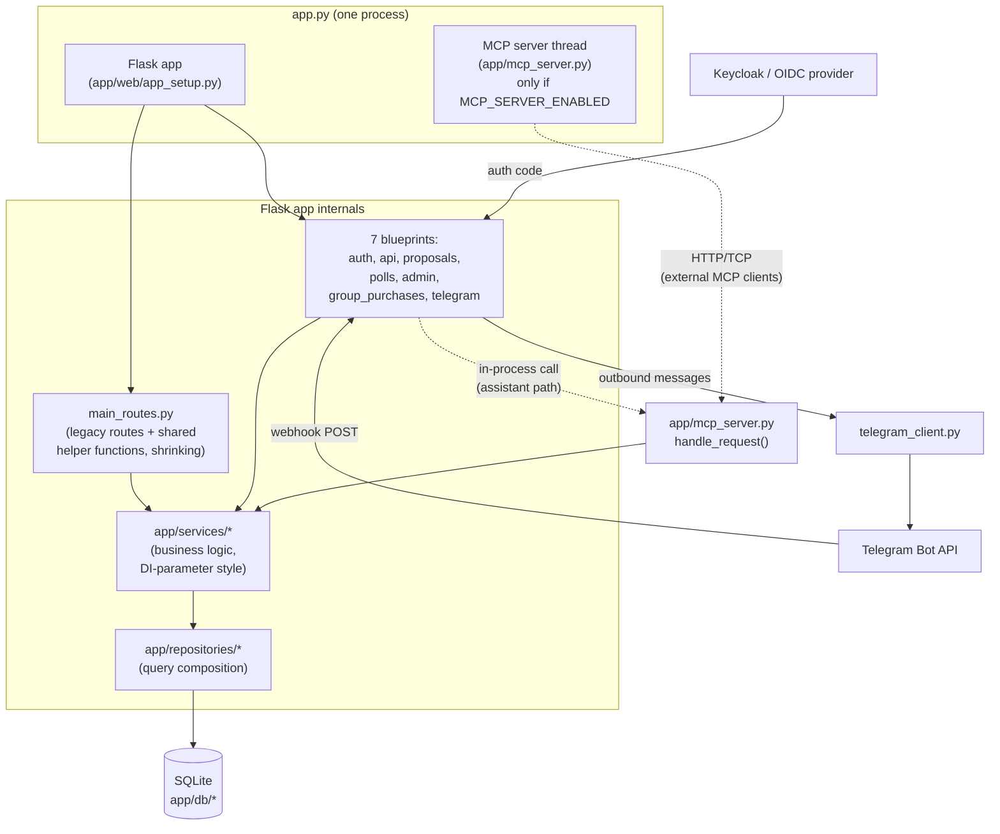
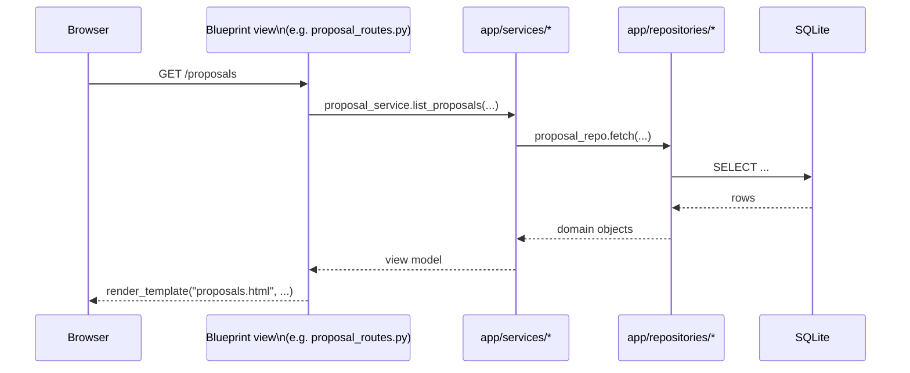
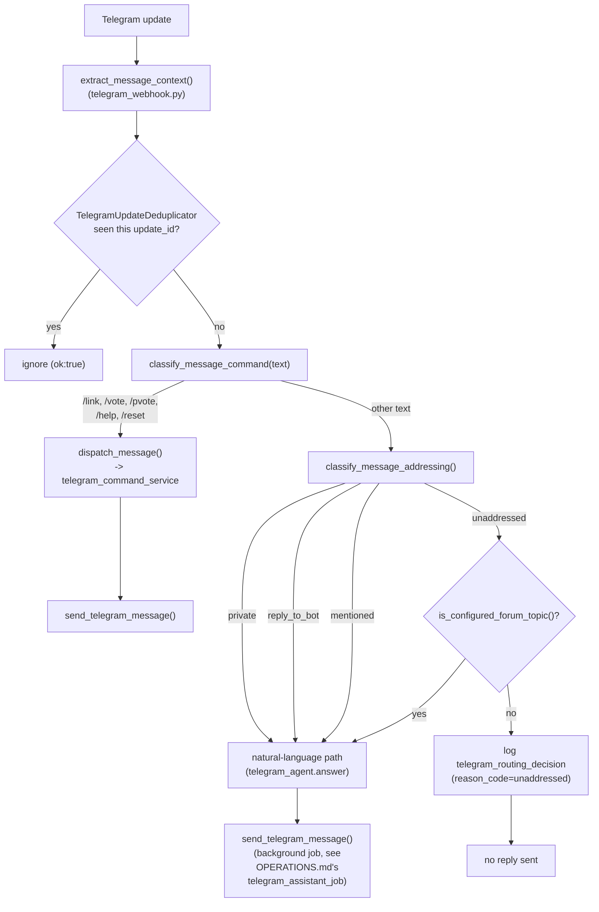
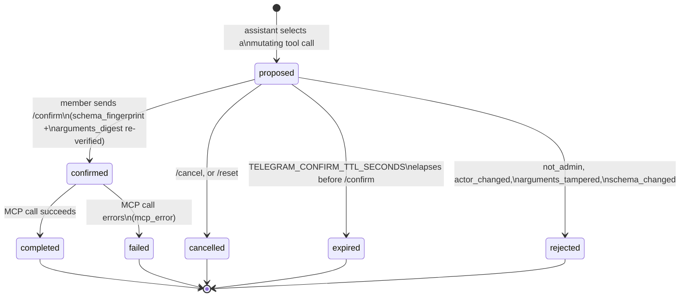
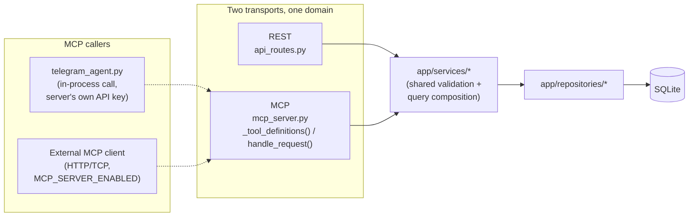
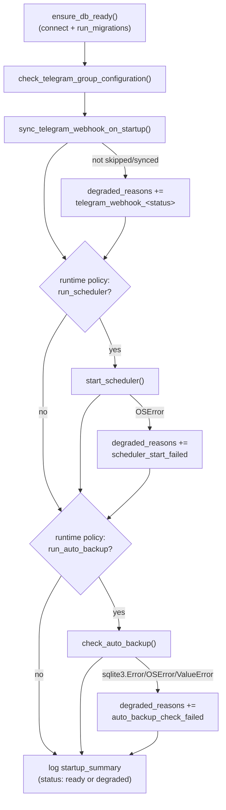
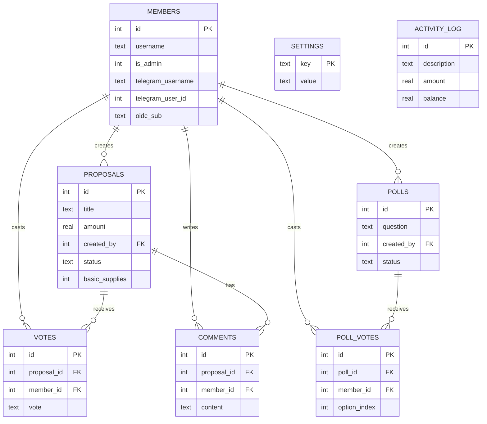

# Architecture Diagrams

Visual reference for how ManaVote is put together. These complement, not replace,
[`SPEC.md`](SPEC.md) (behavior contract) and [`APIDOC.md`](APIDOC.md) (REST/MCP
reference) — read those for exact rules and payload shapes. Diagrams here favor real
module/function names over abstractions so they stay checkable against the code.

Diagrams are Mermaid, rendered natively by GitHub. If a diagram and the code disagree,
the code wins — update the diagram in the same PR that changes the shape it describes.

## Contents

- [Process overview](#process-overview)
- [Request path: web page load](#request-path-web-page-load)
- [Telegram webhook: message routing](#telegram-webhook-message-routing)
- [Telegram assistant: mutation confirm flow](#telegram-assistant-mutation-confirm-flow)
- [MCP and REST: shared service layer](#mcp-and-rest-shared-service-layer)
- [Startup sequence](#startup-sequence)
- [Core data model](#core-data-model)

## Process overview

`app.py` is the single OS-level entrypoint. It always starts the Flask app; the
standalone MCP server is a second, independent thread started only when
`MCP_SERVER_ENABLED` is set — it is not required for the Telegram assistant, which
calls the same MCP tool logic in-process instead (see the MCP diagram below).

## Request path: web page load

Most page views follow the same shape: blueprint view function reads a service, the
service reads a repository, the repository touches SQLite, and the view renders a
Jinja template. `main_routes.py` still holds some of this chain directly (its own
shrinking share of shared helpers) rather than a dedicated service module — see
`IDEAS.md`'s WS-A2 for what's already been extracted and what's left.

## Telegram webhook: message routing

Every inbound Telegram update lands on `telegram_routes.py`'s webhook view. The
addressing decision (`classify_message_addressing`, added in Sprint 6 Goal 3) decides
whether a group-chat message reaches the assistant at all; a configured forum topic can
override an otherwise-unaddressed message. Non-command group messages log a
`telegram_routing_decision` event either way — see `OPERATIONS.md`.

## Telegram assistant: mutation confirm flow

Read-only MCP tools (`list_proposals`, `current_budget`, ...) answer immediately.
Mutating tools (`create_proposal`, `create_poll`, `update_voting_settings` —
`MUTATING_TOOLS` in `telegram_agent.py`) are intercepted and held as a `PendingAction`
until the member sends `/confirm`. Every step emits a `telegram_assistant_mutation`
audit event (Sprint 6 Goal 1) — reason codes are documented in `OPERATIONS.md`.

## MCP and REST: shared service layer

REST (`api_routes.py`) and MCP (`mcp_server.py`) are two independent transports over
the same domain — historically they reimplemented overlapping validation/query logic
separately, which caused real drift bugs (documented in `IDEAS.md`'s "Error-contract
matrix expansion"). Sprint 5 converged the two onto shared service code where their
response shapes are meant to match; some list-endpoint shapes differ *on purpose* and
were explicitly left unconverged (also documented there).

The in-process call from `telegram_agent.py` to `mcp_server.handle_request()` skips
any real application-layer boundary (auth, rate limiting, request shaping) that an
external caller over HTTP would go through — flagged as `IDEAS.md` item 4 (P1),
currently slated to lead Sprint 8.

## Startup sequence

`create_app()` (`app/__init__.py`) wires the Flask app, registers blueprints, then
calls `run_startup_steps()` (`app/startup.py`), which runs a fixed, ordered sequence
and emits one `startup_summary` log line with an overall `ready`/`degraded` status —
see `OPERATIONS.md`'s "Startup health" section for the reason codes.

## Core data model

Simplified to the tables that carry the app's core voting/budget domain — omits
`telegram_update_dedup`, `telegram_pending_actions`, and the `group_purchase_*` family
(five tables on their own; see `SPEC.md` for the full group-purchases model).

