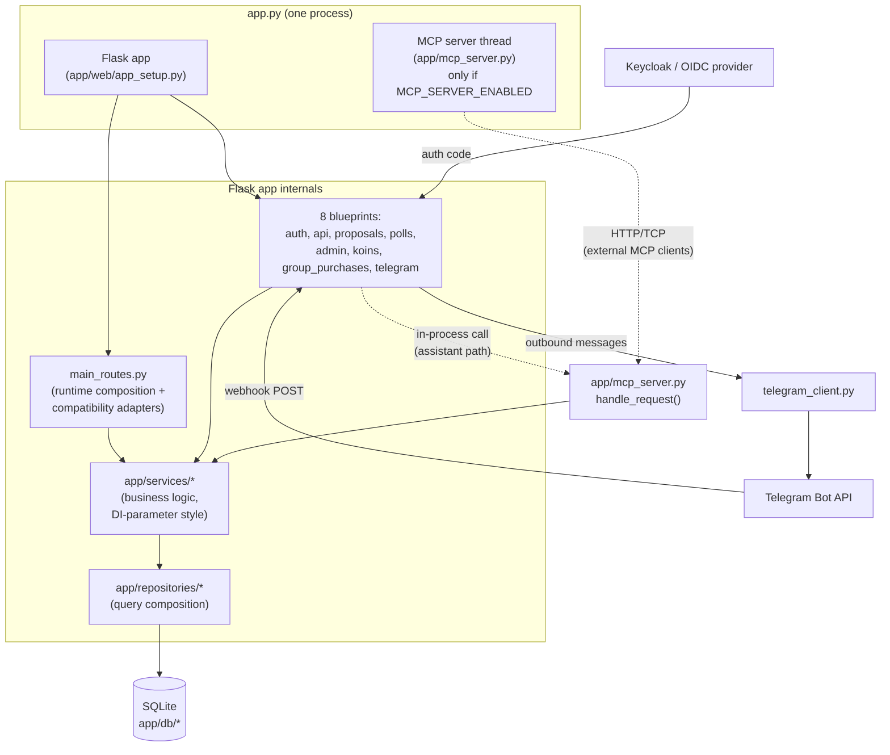
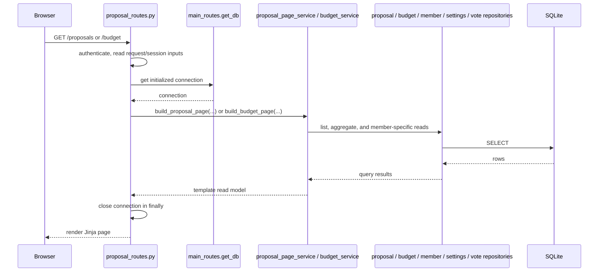
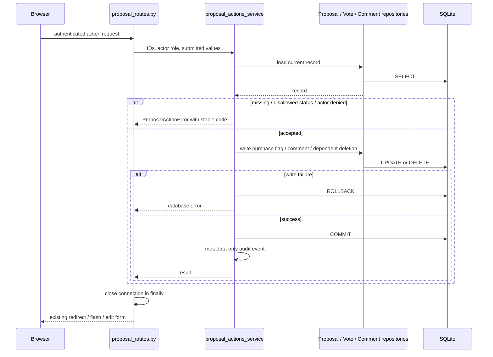
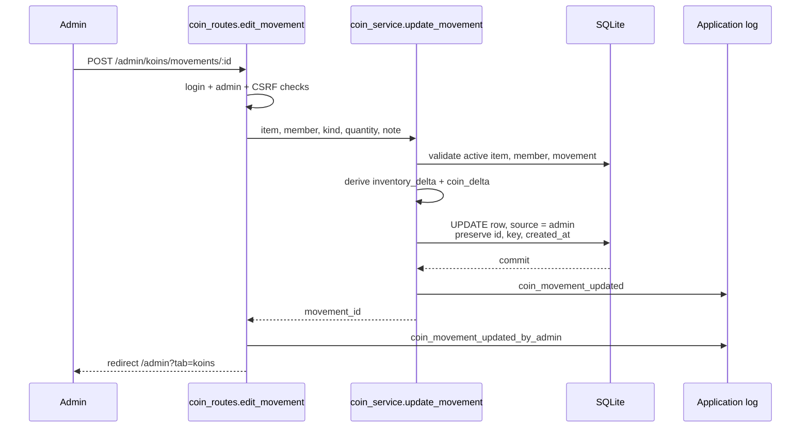
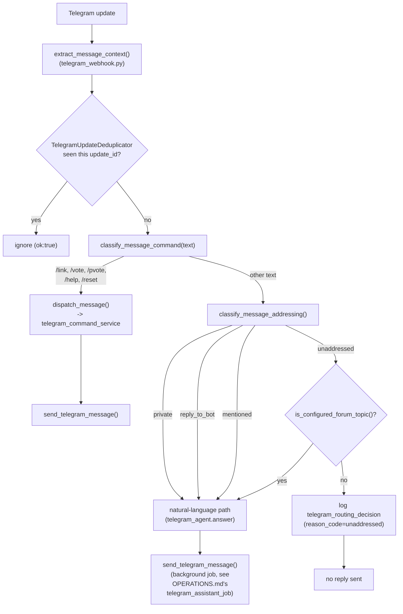
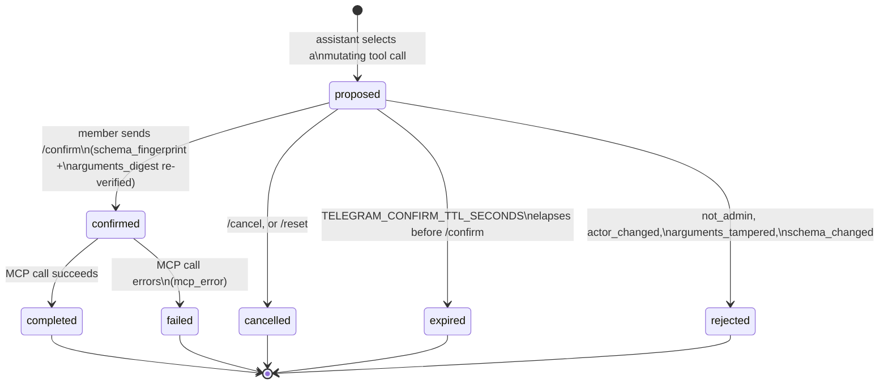
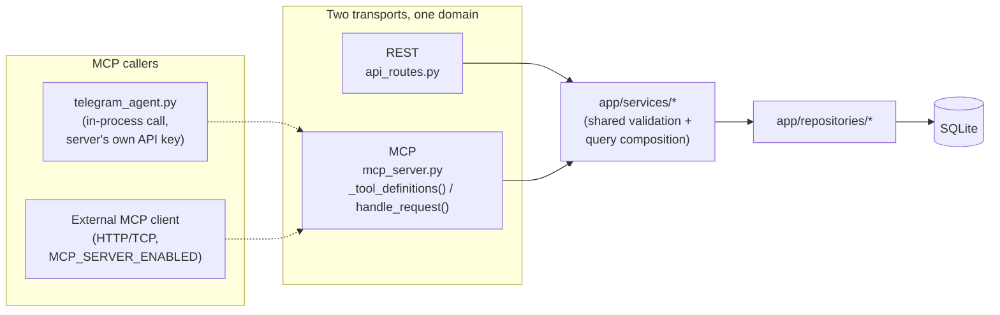
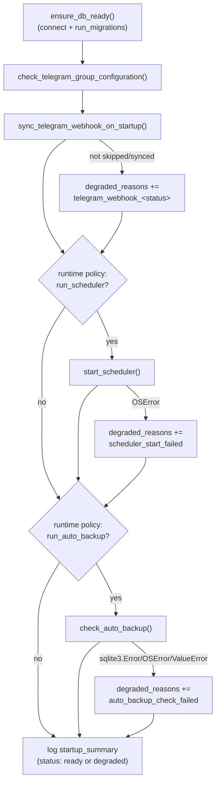
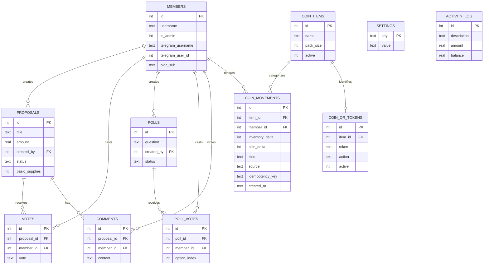
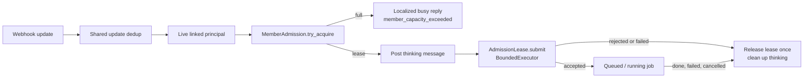

# Architecture Diagrams

Visual reference for how ManaVote is put together. These complement, not replace,
[`SPEC.md`](SPEC.md) (behavior contract) and [`APIDOC.md`](APIDOC.md) (REST/MCP
reference) — read those for exact rules and payload shapes. Diagrams here favor real
module/function names over abstractions so they stay checkable against the code.

Diagrams are Mermaid, rendered natively by GitHub. If a diagram and the code disagree,
the code wins — update the diagram in the same PR that changes the shape it describes.

## Contents

- [Process overview](#process-overview)
- [Request path: web page load](#request-path-web-page-load)
- [Proposal action writes](#proposal-action-writes)
- [Admin koin correction flow](#admin-koin-correction-flow)
- [Telegram webhook: message routing](#telegram-webhook-message-routing)
- [Telegram assistant: mutation confirm flow](#telegram-assistant-mutation-confirm-flow)
- [MCP and REST: shared service layer](#mcp-and-rest-shared-service-layer)
- [Startup sequence](#startup-sequence)
- [Core data model](#core-data-model)
- [Assistant member admission](#assistant-member-admission)

## Process overview

`app.py` is the single OS-level entrypoint. It always starts the Flask app; the
standalone MCP server is a second, independent thread started only when
`MCP_SERVER_ENABLED` is set — it is not required for the Telegram assistant, which
calls the same MCP tool logic in-process instead (see the MCP diagram below).

```mermaid
flowchart TB
    subgraph proc["app.py (one process)"]
        flask["Flask app\n(app/web/app_setup.py)"]
        mcpthread["MCP server thread\n(app/mcp_server.py)\nonly if MCP_SERVER_ENABLED"]
    end

    subgraph flaskapp["Flask app internals"]
        legacy["main_routes.py\n(runtime composition +\ncompatibility adapters)"]
        bps["8 blueprints:\nauth, api, proposals, polls,\nadmin, koins, group_purchases, telegram"]
        services["app/services/*\n(business logic,\nDI-parameter style)"]
        repos["app/repositories/*\n(query composition)"]
    end

    flask --> legacy
    flask --> bps
    legacy --> services
    bps --> services
    services --> repos
    repos --> db[("SQLite\napp/db/*")]

    telegram_api["Telegram Bot API"] -- webhook POST --> bps
    bps -- outbound messages --> telegram_client["telegram_client.py"]
    telegram_client --> telegram_api

    bps -. "in-process call\n(assistant path)" .-> mcpserver["app/mcp_server.py\nhandle_request()"]
    mcpthread -. "HTTP/TCP\n(external MCP clients)" .-> mcpserver
    mcpserver --> services

    oidc["Keycloak / OIDC provider"] -- auth code --> bps
```

## Request path: web page load

The `/budget` and `/proposals` list routes now own authentication, request/session
inputs, rendering, and connection cleanup. `budget_service.build_budget_page` and
`proposal_page_service.build_proposal_page` assemble read models through repositories.
Services borrow the route's connection; the route closes it even when a read fails.
Auth, admin, poll, proposal-detail, group-purchase, QR, and API paths follow the same
query ownership boundary; see the [Sprint 10 inventory](SPRINT_10_INVENTORY.md).
`main_routes.get_db` remains the initialization/runtime adapter; retained helper
wrappers delegate budget/member/vote reads to their repositories.

```mermaid
sequenceDiagram
    participant Browser
    participant Blueprint as proposal_routes.py
    participant Adapter as main_routes.get_db
    participant Service as proposal_page_service / budget_service
    participant Repo as proposal / budget / member / settings / vote repositories
    participant DB as SQLite

    Browser->>Blueprint: GET /proposals or /budget
    Blueprint->>Blueprint: authenticate, read request/session inputs
    Blueprint->>Adapter: get initialized connection
    Adapter-->>Blueprint: connection
    Blueprint->>Service: build_proposal_page(...) or build_budget_page(...)
    Service->>Repo: list, aggregate, and member-specific reads
    Repo->>DB: SELECT
    DB-->>Repo: rows
    Repo-->>Service: query results
    Service-->>Blueprint: template read model
    Blueprint->>Blueprint: close connection in finally
    Blueprint-->>Browser: render Jinja page
```

## Proposal action writes

Purchase/unpurchase, proposal deletion, and admin comment editing/deletion use
`proposal_actions_service`. HTTP adapters keep login/method checks and existing
redirect/flash semantics. The service enforces status and owner/admin rules, borrowing
the route's connection and committing or rolling back the write transaction. Purchase
flags retain their existing signed-in-member policy. Other lifecycle operations remain
in the [Sprint 10 inventory](SPRINT_10_INVENTORY.md).

```mermaid
sequenceDiagram
    participant Browser
    participant Route as proposal_routes.py
    participant Service as proposal_actions_service
    participant Repo as Proposal / Vote / Comment repositories
    participant DB as SQLite

    Browser->>Route: authenticated action request
    Route->>Service: IDs, actor role, submitted values
    Service->>Repo: load current record
    Repo->>DB: SELECT
    Repo-->>Service: record
    alt missing / disallowed status / actor denied
        Service-->>Route: ProposalActionError with stable code
    else accepted
        Service->>Repo: write purchase flag / comment / dependent deletion
        Repo->>DB: UPDATE or DELETE
        alt write failure
            Service->>DB: ROLLBACK
            Service-->>Route: database error
        else success
            Service->>DB: COMMIT
            Service->>Service: metadata-only audit event
            Service-->>Route: result
        end
    end
    Route->>Route: close connection in finally
    Route-->>Browser: existing redirect / flash / edit form
```

## Admin koin correction flow

Member, QR, and MCP koin actions append movements through the shared koin service. An
administrator can use the explicit correction path for an existing row; the route is
protected by login, admin-role, and CSRF checks. The service validates references and
quantity, derives signed deltas from the selected movement kind, preserves the row's
identity and timestamp, and marks the corrected source as `admin`.

```mermaid
sequenceDiagram
    participant Admin
    participant Route as coin_routes.edit_movement
    participant Service as coin_service.update_movement
    participant DB as SQLite
    participant Log as Application log

    Admin->>Route: POST /admin/koins/movements/:id
    Route->>Route: login + admin + CSRF checks
    Route->>Service: item, member, kind, quantity, note
    Service->>DB: validate active item, member, movement
    Service->>Service: derive inventory_delta + coin_delta
    Service->>DB: UPDATE row, source = admin<br/>preserve id, key, created_at
    DB-->>Service: commit
    Service->>Log: coin_movement_updated
    Service-->>Route: movement_id
    Route->>Log: coin_movement_updated_by_admin
    Route-->>Admin: redirect /admin?tab=koins
```

## Telegram webhook: message routing

Every inbound Telegram update lands on `telegram_routes.py`'s webhook view. The
addressing decision (`classify_message_addressing`, added in Sprint 6 Goal 3) decides
whether a group-chat message reaches the assistant at all; a configured forum topic can
override an otherwise-unaddressed message. Non-command group messages log a
`telegram_routing_decision` event either way — see `OPERATIONS.md`.

```mermaid
flowchart TD
    update["Telegram update"] --> extract["extract_message_context()\n(telegram_webhook.py)"]
    extract --> dedup{"TelegramUpdateDeduplicator\nseen this update_id?"}
    dedup -- yes --> drop["ignore (ok:true)"]
    dedup -- no --> cmd["classify_message_command(text)"]

    cmd -- "/link, /vote, /pvote,\n/help, /reset" --> dispatch["dispatch_message()\n-> telegram_command_service"]
    cmd -- "other text" --> addr["classify_message_addressing()"]

    addr -- private --> nl["natural-language path\n(telegram_agent.answer)"]
    addr -- reply_to_bot --> nl
    addr -- mentioned --> nl
    addr -- unaddressed --> topic{"is_configured_forum_topic()?"}
    topic -- yes --> nl
    topic -- no --> log["log telegram_routing_decision\n(reason_code=unaddressed)"] --> ignore["no reply sent"]

    dispatch --> reply1["send_telegram_message()"]
    nl --> reply2["send_telegram_message()\n(background job, see\nOPERATIONS.md's\ntelegram_assistant_job)"]
```

## Telegram assistant: mutation confirm flow

Read-only MCP tools (`list_proposals`, `current_budget`, ...) answer immediately.
Mutating tools (`create_proposal`, `create_poll`, `update_voting_settings` —
`MUTATING_TOOLS` in `telegram_agent.py`) are intercepted and held as a `PendingAction`
until the member sends `/confirm`. Every step emits a `telegram_assistant_mutation`
audit event (Sprint 6 Goal 1) — reason codes are documented in `OPERATIONS.md`.

```mermaid
stateDiagram-v2
    [*] --> proposed: assistant selects a\nmutating tool call
    proposed --> confirmed: member sends /confirm\n(schema_fingerprint +\narguments_digest re-verified)
    proposed --> cancelled: /cancel, or /reset
    proposed --> expired: TELEGRAM_CONFIRM_TTL_SECONDS\nelapses before /confirm
    proposed --> rejected: not_admin, actor_changed,\narguments_tampered,\nschema_changed
    confirmed --> completed: MCP call succeeds
    confirmed --> failed: MCP call errors\n(mcp_error)
    completed --> [*]
    failed --> [*]
    cancelled --> [*]
    expired --> [*]
    rejected --> [*]
```

## MCP and REST: shared service layer

REST (`api_routes.py`) and MCP (`mcp_server.py`) are two independent transports over
the same domain — historically they reimplemented overlapping validation/query logic
separately, which caused real drift bugs (documented in `IDEAS.md`'s "Error-contract
matrix expansion"). Sprint 5 converged the two onto shared service code where their
response shapes are meant to match; some list-endpoint shapes differ *on purpose* and
were explicitly left unconverged (also documented there).

```mermaid
flowchart LR
    subgraph transports["Two transports, one domain"]
        rest["REST\napi_routes.py"]
        mcp["MCP\nmcp_server.py\n_tool_definitions() / handle_request()"]
    end
    rest --> services["app/services/*\n(shared validation +\nquery composition)"]
    mcp --> services
    services --> repos["app/repositories/*"]
    repos --> db[("SQLite")]

    subgraph mcpclients["MCP callers"]
        telegram["telegram_agent.py\n(in-process call,\nserver's own API key)"]
        external["External MCP client\n(HTTP/TCP,\nMCP_SERVER_ENABLED)"]
    end
    telegram -.-> mcp
    external -.-> mcp
```

The in-process call from `telegram_agent.py` to `mcp_server.handle_request()` used to
skip any real application-layer authorization boundary — flagged as `IDEAS.md` item 4
(P1). Sprint 8 closed it (`bf24b6c`): `app/services/mcp_application.py`'s
`execute_tool()` now checks an `Actor`'s role against each tool's policy
(`app/services/mcp_tool_registry.py`) and binds identity fields (e.g. a member can only
attribute a mutation to their own `member_id`) before invoking the executor, for both
the in-process Telegram path and external callers alike.

## Startup sequence

`create_app()` (`app/__init__.py`) wires the Flask app, registers blueprints, then
calls `run_startup_steps()` (`app/startup.py`), which runs a fixed, ordered sequence
and emits one `startup_summary` log line with an overall `ready`/`degraded` status —
see `OPERATIONS.md`'s "Startup health" section for the reason codes.

```mermaid
flowchart TD
    A["ensure_db_ready()\n(connect + run_migrations)"] --> B["check_telegram_group_configuration()"]
    B --> C["sync_telegram_webhook_on_startup()"]
    C -->|not skipped/synced| D1["degraded_reasons +=\ntelegram_webhook_&lt;status&gt;"]
    C --> E{"runtime policy:\nrun_scheduler?"}
    D1 --> E
    E -- yes --> F["start_scheduler()"]
    F -->|OSError| D2["degraded_reasons +=\nscheduler_start_failed"]
    E -- no --> G
    F --> G{"runtime policy:\nrun_auto_backup?"}
    D2 --> G
    G -- yes --> H["check_auto_backup()"]
    H -->|sqlite3.Error/OSError/ValueError| D3["degraded_reasons +=\nauto_backup_check_failed"]
    G -- no --> I["log startup_summary\n(status: ready or degraded)"]
    H --> I
    D3 --> I
```

## Core data model

Simplified to the tables that carry the app's core voting, budget, and koin domains — omits
`telegram_update_dedup`, `telegram_pending_actions`, and the `group_purchase_*` family
(five tables on their own; see `SPEC.md` for the full group-purchases model).

```mermaid
erDiagram
    MEMBERS ||--o{ PROPOSALS : creates
    MEMBERS ||--o{ VOTES : casts
    MEMBERS ||--o{ POLLS : creates
    MEMBERS ||--o{ POLL_VOTES : casts
    MEMBERS ||--o{ COMMENTS : writes
    MEMBERS ||--o{ COIN_MOVEMENTS : records
    PROPOSALS ||--o{ VOTES : receives
    PROPOSALS ||--o{ COMMENTS : has
    POLLS ||--o{ POLL_VOTES : receives
    COIN_ITEMS ||--o{ COIN_MOVEMENTS : categorizes
    COIN_ITEMS ||--o| COIN_QR_TOKENS : identifies

    MEMBERS {
        int id PK
        text username
        int is_admin
        text telegram_username
        int telegram_user_id
        text oidc_sub
    }
    PROPOSALS {
        int id PK
        text title
        real amount
        int created_by FK
        text status
        int basic_supplies
    }
    VOTES {
        int id PK
        int proposal_id FK
        int member_id FK
        text vote
    }
    POLLS {
        int id PK
        text question
        int created_by FK
        text status
    }
    POLL_VOTES {
        int id PK
        int poll_id FK
        int member_id FK
        int option_index
    }
    COMMENTS {
        int id PK
        int proposal_id FK
        int member_id FK
        text content
    }
    COIN_ITEMS {
        int id PK
        text name
        int pack_size
        int active
    }
    COIN_MOVEMENTS {
        int id PK
        int item_id FK
        int member_id FK
        int inventory_delta
        int coin_delta
        text kind
        text source
        text idempotency_key
        text created_at
    }
    COIN_QR_TOKENS {
        int id PK
        int item_id FK
        text token
        text action
        int active
    }
    SETTINGS {
        text key PK
        text value
    }
    ACTIVITY_LOG {
        int id PK
        text description
        real amount
        real balance
    }
```

## Assistant member admission

`member_admission.MemberAdmission` is a singleton beside the bounded executor in each
process. The webhook resolves a live principal, then reserves by linked member ID
before posting `Thinking…`. Deduplicated updates exit before admission. Rejected
confirm/cancel requests do not touch pending mutations.

```mermaid
flowchart LR
    Update["Webhook update"] --> Dedup["Shared update dedup"]
    Dedup --> Principal["Live linked principal"]
    Principal --> Member["MemberAdmission.try_acquire"]
    Member -->|full| Busy["Localized busy reply\nmember_capacity_exceeded"]
    Member -->|lease| Thinking["Post thinking message"]
    Thinking --> Submit["AdmissionLease.submit\nBoundedExecutor"]
    Submit -->|accepted| Work["Queued / running job"]
    Submit -->|rejected or failed| Release["Release lease once\nclean up thinking"]
    Work -->|done, failed, cancelled| Release
```

The positive integer `TELEGRAM_AGENT_MAX_JOBS_PER_MEMBER` defaults to one. It counts
queued plus running jobs across chats in one process; WSGI processes multiply this
limit and the independent four-worker/32-pending global bound.
